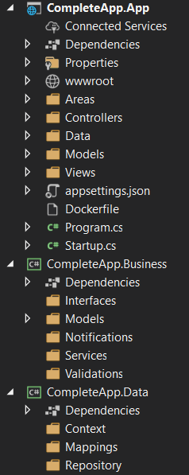
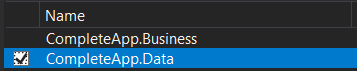
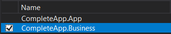
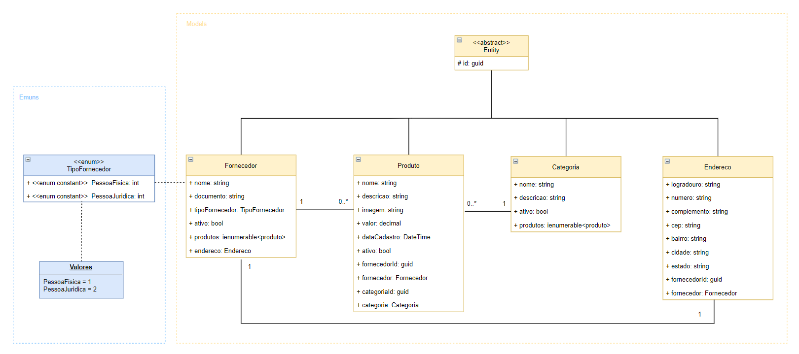
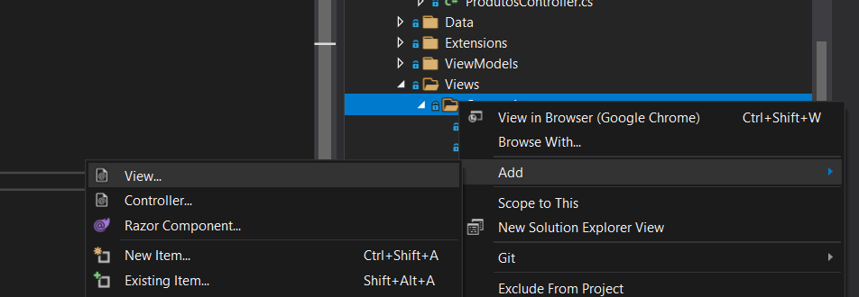
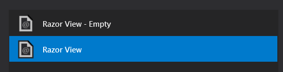

<div id="top"></div>

<br/>
<div align="center">
    
    
    <h1 align="center">ASP.NET Core MVC</h1>
    <p align="center">Desenvolvimento de uma aplicação ASP.NET Core MVC</p>
</div>

<br/>

<div align="center">
    <a href="https://github.com/YuriSiman/complete-app-crud-aspnetcore-mvc/blob/master/LICENSE" target="_blank">
      
    </a>
    <a href="https://github.com/YuriSiman" target="_blank">
      
    </a>
    <a href="https://yurisiman.com.br" target="_blank">
      
    </a>
    <a href="https://www.linkedin.com/in/yurisiman/" target="_blank">
      
    </a>
    <a href="mailto:contato@yurisiman.com.br" target="_blank">
      
    </a>
</div>

<br/>

## :clipboard: Sobre o Projeto

O objetivo deste projeto é implementar uma aplicação ASP.NET Core MVC utilizando C#, a aplicação contém um CRUD completo dos dados, utilizando Entity Framework para persistência, Identity para autenticação do usuário, Fluent API e outras tecnologias.

Use este projeto para aprender e contribua com melhorias! Bora estudar! :computer::coffee:

---

## :pencil: Pré-requisitos

1. Construído com .NET 6.0 e codificado em C#, se você não possui o dotnet instalado, acesse [aqui](https://dotnet.microsoft.com/) e instale a versão mais recente.
2. Clone este repositório em sua máquina local

   ```sh
   git clone https://github.com/YuriSiman/complete-app-crud-aspnetcore-mvc.git
   ```

---

## :dart: Tópicos

<details>
  <summary>Configurações Iniciais</summary>
  <ul>
    <li><a href="#setup-inicial-da-aplicacao">Setup Inicial da Aplicação</a></li>
    <li><a href="#instalacao-de-pacotes">Instalação de Pacotes</a></li>
    <li><a href="#referencia-de-projetos">Referência de Projetos</a></li>
    <li><a href="#entidades">Entidades</a></li>
    <li><a href="#variaveis-de-ambiente">Variáveis de Ambiente</a></li>
    <li><a href="#configurations">Configurations</a></li>
  </ul>
</details>
<details>
  <summary>Banco de Dados</summary>
  <ul>
    <li><a href="#dbcontext">DbContext</a></li>
    <li><a href="#mappings">Mappings</a></li>
    <li><a href="#migrations">Migrations</a></li>
    <li><a href="#repository-pattern">Repository Pattern</a></li>
  </ul>
</details>
<details>
  <summary>Mapeamento de Objetos</summary>
  <ul>
    <li><a href="#viewmodels">ViewModels (DTO)</a></li>
    <li><a href="#automapper">AutoMapper</a></li>
  </ul>
</details>
<details>
  <summary>MVC (Controllers e Views)</summary>
  <ul>
    <li><a href="#controllers">Controllers</a></li>
    <li><a href="#views">Views</a></li>
  </ul>
</details>
<details>
  <summary>Customizações</summary>
  <ul>
    <li><a href="#upload-de-arquivos">Upload de Arquivos</a></li>
    <li><a href="#globalizando-a-aplicacao">Globalizando a Aplicação em pt-BR</a></li>
    <li><a href="#validacoes-de-campos">Validações de Campos em Português</a></li>
    <li><a href="#attributes">Attributes</a></li>
    <li><a href="#razor-extensions">RazorExtensions - Formatação de CPF/CNPJ</a></li>
    <li><a href="#modal-window">Modal Window</a></li>
    <li><a href="#busca-cep">Busca CEP</a></li>
    <li><a href="#tag-helpers">TagHelpers</a></li>
  </ul>
</details>
<details>
  <summary>Validations e Service</summary>
  <ul>
    <li><a href="#fluent-validation">Fluent Validation</a></li>
    <li><a href="#validations">Validations</a></li>
    <li><a href="#services">Services</a></li>
  </ul>
</details>
<details>
  <summary>Segurança e Autenticação do Usuário</summary>
  <ul>
    <li><a href="#identity">Identity</a></li>
    <li><a href="#tratamento-de-erros">Tratamento de Erros</a></li>
    <li><a href="#evitando-falhas-de-segurança">Evitando Falhas de Segurança</a></li>
  </ul>
</details>

---

## :rocket: Vamos Começar

### Configurações Iniciais

<div id="setup-inicial-da-aplicacao"></div>

### Setup Inicial da Aplicação    

A aplicação consiste em três camadas:

Api - configuração do projeto ASP.NET Core Web API. Nele está contido as configurações da aplicação, nossas Controllers, o Identity para autenticação de usuários, configurações de ambiente, nossa classe Startup e nosso método Main. Ela será a camada que fará toda a comunicação e tráfego de dados.

Business - configuração de uma Class Library .NET Core para as regras de negócio da aplicação, camada de domínio. Onde se encontra as Entidades de negócio, notificações, validações e serviços.

Data - configuração de uma Class Library .NET Core para a camada de dados da aplicação, nele está contido o DbContext para o contexto de dados, as referências ao Entity Framework, Mappings, Migrations e Repositórios.



<p align="right"><a href="#top">Início ↑</a></p>

---

<div id="instalacao-de-pacotes"></div>

### Instalação de Pacotes  

Pacotes a serem instalados pelo Package Manager Console ou Manage NuGet Packages:

Projeto - Camada Api

```sh
Install-Package Microsoft.EntityFrameworkCore.SqlServer
Install-Package Microsoft.EntityFrameworkCore.Design
Install-Package Automapper.Extensions.Microsoft.DependencyInjection
```

Projeto - Camada Data

```sh
Install-Package Microsoft.EntityFrameworkCore
Install-Package Microsoft.EntityFrameworkCore.Relational
Install-Package Microsoft.EntityFrameworkCore.Tools
Install-Package Microsoft.EntityFrameworkCore.SqlServer
```

<p align="right"><a href="#top">Início ↑</a></p>

---

<div id="referencia-de-projetos"></div>

### Referência de Projetos

Projeto - Camada Api: Referência com o projeto Business e Data  
  
<br/>
Projeto - Camada Data: Referência com o projeto Business  
  

<p align="right"><a href="#top">Início ↑</a></p>

---

<div id="entidades"></div>

### Entidades 

Modelo Entidade-Relacionamento



<p align="right"><a href="#top">Início ↑</a></p>

---

<div id="variaveis-de-ambiente"></div>

### Variáveis de Ambiente  

Alterando o construtor da Startup, para que se possa permitir a configuração de appsettings para cada tipo de ambiente.

```csharp
public Startup(IHostEnvironment hostEnvironment)
        {
            var builder = new ConfigurationBuilder()
                .SetBasePath(hostEnvironment.ContentRootPath)
                .AddJsonFile("appsettings.json", true, true)
                .AddJsonFile($"appsettings.{hostEnvironment.EnvironmentName}.json", true, true)
                .AddEnvironmentVariables();

            if (hostEnvironment.IsDevelopment())
            {
                builder.AddUserSecrets<Startup>();
            }

            Configuration = builder.Build();
        }
```

Craindo arquivos appsettings para cada tipo de ambiente:

- appsettings.Development.json
- appsettings.Staging.json
- appsettings.Production.json

Modificando arquivo launchSettings.json para cada tipo de ambiente:

```json
{
  "iisSettings": {
    "windowsAuthentication": false,
    "anonymousAuthentication": true,
    "iisExpress": {
      "applicationUrl": "http://localhost:50162",
      "sslPort": 44363
    }
  },
  "profiles": {
    "IIS - Dev": {
      "commandName": "IISExpress",
      "launchBrowser": true,
      "environmentVariables": {
        "ASPNETCORE_ENVIRONMENT": "Development",
        "ASPNETCORE_HOSTINGSTARTUPASSEMBLIES": "Microsoft.AspNetCore.Mvc.Razor.RuntimeCompilation"
      }
    },
    "IIS - Staging": {
      "commandName": "IISExpress",
      "launchBrowser": true,
      "environmentVariables": {
        "ASPNETCORE_ENVIRONMENT": "Staging",
        "ASPNETCORE_HOSTINGSTARTUPASSEMBLIES": "Microsoft.AspNetCore.Mvc.Razor.RuntimeCompilation"
      }
    },
    "IIS - Prod": {
      "commandName": "IISExpress",
      "launchBrowser": true,
      "environmentVariables": {
        "ASPNETCORE_ENVIRONMENT": "Production",
        "ASPNETCORE_HOSTINGSTARTUPASSEMBLIES": "Microsoft.AspNetCore.Mvc.Razor.RuntimeCompilation"
      }
    },
    "Self Hosting": {
      "commandName": "Project",
      "launchBrowser": true,
      "environmentVariables": {
        "ASPNETCORE_ENVIRONMENT": "Development",
        "ASPNETCORE_HOSTINGSTARTUPASSEMBLIES": "Microsoft.AspNetCore.Mvc.Razor.RuntimeCompilation"
      },
      "dotnetRunMessages": "true",
      "applicationUrl": "https://localhost:5001;http://localhost:5000"
    },
    "Docker": {
      "commandName": "Docker",
      "launchBrowser": true,
      "launchUrl": "{Scheme}://{ServiceHost}:{ServicePort}",
      "publishAllPorts": true,
      "useSSL": true
    }
  }
}
```

<p align="right"><a href="#top">Início ↑</a></p>  

---

<div id="configurations"></div>

### Configurations  

Implementando pasta Configurations onde serão criadas as classes de configuração da Startup, tendo como objetivo desacoplar a classe Startup, deixando-a mais limpa e reduzida. As classes de Configuração precisarão implementar métodos de extensão do IServiceCollection, IConfiguration, IApplicationBuilder e IHostEnvironment. As configurações irão variar conforme a sua necessidade. Segue abaixo exemplo de configuração do DbContext.

DbContextConfig:

```csharp
namespace CompleteApi.Api.Configurations
{
    public static class DbContextConfig
    {
        public static IServiceCollection AddDbContextConfiguration(this IServiceCollection services, IConfiguration configuration)
        {
            services.AddDbContext<MvcDbContext>(options =>
                options.UseSqlServer(configuration.GetConnectionString("DefaultConnection")));

            return services;
        }
    }
}
```

Startup:

```csharp
public void ConfigureServices(IServiceCollection services)
{
   services.AddDbContextConfiguration(Configuration);
}
```

Exemplos de Configurations a serem implementadas:

- DbContextConfig
- DependencyInjectionConfig
- SwaggerConfig
- MvcConfig

<p align="right"><a href="#top">Início ↑</a></p>

---

### Banco de Dados

<div id="dbcontext"></div>

### DbContext    

Contexto de Dados
O seu contexto de dados deve herdar da classe DbContext, implementando as propriedades DbSet referente a cada entidade da sua aplicação. Deve-se sobrescrever o método OnModelCreating, para que nele possamos pegar nosso contexto de dados, buscar todas as entidades mapeadas pelo DbSet e buscar classes que implementam a interface IEntityTypeConfiguration, ou seja, ele pegará cada um dos Mappings a serem implementados e fará o mapeamento de uma vez só.

No método OnModelCreating também podemos desabilitar o Cascade Delete, ou seja, desabilitar a exclusão de objetos ligados diretamente a uma outra entidade. Ex: excluir um fornecedor e todos os seus produtos juntos.

Configurando seu DbContext na configuração da classe Startup - DbContextConfig
É necessário configurar o serviço do seu contexto de dados dentro da sua classe Startup, no método ConfigureServices. Para isso, iremos implementar dentro da classe de configuração DbContextConfig. Segue exemplo de implementação abaixo.

DbContextConfig:

```csharp
namespace CompleteApi.Api.Configurations
{
    public static class DbContextConfig
    {
        public static IServiceCollection AddDbContextConfiguration(this IServiceCollection services, IConfiguration configuration)
        {
            services.AddDbContext<MvcDbContext>(options =>
                options.UseSqlServer(configuration.GetConnectionString("DefaultConnection")));

            return services;
        }
    }
}
```

Startup:

```csharp
services.AddDbContextConfiguration(Configuration);
```

Também é preciso configurar o serviço para injeção de dependência do seu DbContext na classe Startup, no método ConfigureServices, para isso, criaremos uma nova classe de configuração chamada DependencyInjectionConfig. E lá, faremos a injeção de dependência.

```csharp
namespace CompleteApi.Api.Configurations
{
    public static class DependencyInjectionConfig
    {
        public static IServiceCollection ResolveDependencies(this IServiceCollection services)
        {
            services.AddScoped<MvcDbContext>();

            return services;
        }
    }
}
```

Depois, chamaremos o serviço dentro da Startup:

```csharp
services.ResolveDependencies();
```

Configurando o arquivo appsettings.json

Após a implementação do DbContext na Startup, é necessário passar as informações do banco de dados na ConnectionStrings dentro do arquivo appsettings.json. Essa ConnectionString possui a DefaultConnection que é chamada dentro do serviço que adiciona o seu contexto de dados na sua classe Startup.

```json
"ConnectionStrings": {
    "DefaultConnection": "Server=(localdb)\\mssqllocaldb;Database=SeuDb;Trusted_Connection=True;MultipleActiveResultSets=true"
  }
```

<p align="right"><a href="#top">Início ↑</a></p>

---

<div id="mappings"></div>

### Mappings

Criando o mapeamento e relacionamento das entidades no banco de dados...

<p align="right"><a href="#top">Início ↑</a></p>

---

<div id="migrations"></div>

### Migrations  

Package Manager Console

Gerando Migrations

```sh
Add-Migration NomeMigration -Context SeuDbContext
```

Gerando Base de Dados

```sh
Update-Database -Context SeuDbContext
```

Gerando Scripts Idempotentes

```sh
Script-Migration -Idempotent
```

<p align="right"><a href="#top">Início ↑</a></p>

---

<div id="repository-pattern"></div>

### Repository Pattern

O repository pattern é implementado nesta aplicação para que as camadas de Business e App possuam um meio de acesso para conversar com o banco de dados, que não seja diretamente pelo DbContext, pois, não é adequado injetar o DbContext diretamente nas Controllers, devemos sempre buscar o desacoplamento do meio de acesso a dados.

IRepository - Camada Business

Devemos criar a interface genérica IRepository dentro da camada de Negócios (Business) para que a camada de Negócios não tenha nenhuma referência com a camada de Dados (Data), ela irá "conversar" com a camada de dados por meio da interface IRepository, para que ela possa fornecer os métodos necessários para os repositórios que ficarão na camada de dados.
Esta interface deverá implementar a interface IDisposable para obrigar que o repositório faça a liberação de memória. Outro detalhe é o fato de podermos configurar para que a interface IRepository apenas seja utilizada por entidades que sejam filhas (que herdem) da classe Entity.

Seguem os métodos assíncronos a serem implementados na interface genérica:

```csharp
Task Adicionar(TEntity entity);
Task<TEntity> ObterPorId(Guid id);
Task<List<TEntity>> ObterTodos();
Task Atualizar(TEntity entity);
Task Remover(Guid id);
Task<IEnumerable<TEntity>> Buscar(Expression<Func<TEntity, bool>> predicate);
Task<int> SaveChanges();
```

Agora deve-se criar as interfaces referentes a cada entidade que será persistida no banco de dados da sua aplicação, e cada uma delas deverá implementar a interface genérica IRepository. Isso nos dará uma maior autonomia para manipular dados de forma independente para cada entidade.

Repository - Camada Data

Criando classe abstrata e genérica Repository implementando a interface genérica IRepository, onde a entidade TEntity precisar ser filha (herdar) da entidade abstrata Entity.
Nesta classe serão implementados os métodos da interface para a persistência dos dados da aplicação. Os métodos são assíncronos possuindo o termo async e podemos também implementar o virtual para que os mesmos possam ser sobrescritos.

Agora deve-se criar as classes referentes a cada entidade que será persistida no banco de dados da sua aplicação, e cada uma delas deverá herdar de Repository (a entidade correspondente da classe) e também implementar a interface correspondente à mesma entidade. Os métodos são assíncronos possuindo o termo async.

Configurando os repositórios na classe Startup por meio de injeção de dependência
É preciso configurar o serviço para injeção de dependência dos seus repositórios na classe Startup, no método ConfigureServices, para isso, utilizaremos nossa classe de configuração de injeção de dependência DependencyInjectionConfig e colocaremos conforme o exemplo abaixo:

```csharp
services.AddScoped<IProdutoRepository, ProdutoRepository>();
services.AddScoped<IFornecedorRepository, FornecedorRepository>();
services.AddScoped<IEnderecoRepository, EnderecoRepository>();
services.AddScoped<ICategoriaRepository, CategoriaRepository>();
```

<p align="right"><a href="#top">Início ↑</a></p>

---

### Mapeamento de Objetos

<div id="viewmodels"></div>

### ViewModels (DTO)    

Troca de informação entre os modelos de negócio (Business) com os modelos que serão exibidos na camada de apresentação (App), replicando os modelos de negócio para modelos intermediários chamados de ViewModels ou DTO (Data Transfer Object).

Não queremos "deformar" nossas entidades de negócio colocando campos que não serão mapeados no banco, mapeando propriedades que não são ligados à regra de negócio... queremos simplesmente criar modelos que sejam passíveis de serem exibidos na tela. Então, devemos criar uma ViewModel para cada Model existente em nossa camada de negócio. As ViewModels criadas precisam ter as propriedades necessárias e também o Id referente a cada entidade (uma vez que não iremos herdar de nenhuma Entity).

Data Annotations

Devemos implementar os Data Annotations para mapear cada propriedade referente a cada ViewModel.

<p align="right"><a href="#top">Início ↑</a></p>

---

<div id="automapper"></div>

### AutoMapper  

Package Manager Console

Projeto - Camada App

```sh
Install-Package Automapper.Extensions.Microsoft.DependencyInjection
```

Configurando o Automapper na classe Startup

É preciso configurar o serviço do AutoMapper na classe Startup, no método ConfigureServices, conforme o exemplo abaixo:

```csharp
services.AddAutoMapper(typeof(Startup));
```

Devemos criar uma classe AutoMapperConfig para configuração do Automapper, a classe deverá herdar de Profile. Nesta classe será definido o mapeamento das ViewModels e Models, segue exemplo abaixo:

```csharp
public AutoMapperConfig()
{
   CreateMap<Fornecedor, FornecedorViewModel>().ReverseMap();
   CreateMap<Endereco, EnderecoViewModel>().ReverseMap();
   CreateMap<Produto, ProdutoViewModel>().ReverseMap();
   CreateMap<Categoria, CategoriaViewModel>().ReverseMap();
}
```

<p align="right"><a href="#top">Início ↑</a></p>

---

### MVC (Constrollers e Views)

<div id="controllers"></div>

### Controllers

Ao criar cada Controller nós devemos chamar o repositório referente a cada uma delas pela interface para que tenhamos o meio de acesso a dados, também chamaremos nosso AutoMapper para fazer o mapeamento de Model e ViewModel.

<p align="right"><a href="#top">Início ↑</a></p>

---

<div id="views"></div>

### Views

Para cada Controller criada, também criaremos as View. Podemos criar o modelo inicial das Views por meio do Visual Studio 2019, gerando automaticamente por Scaffolded as telas baseadas em nossas ViewModels, são elas:

```
Create
Delete
Details
Edit
Index
```

Passo a passo para criar cada uma das Views:





<p align="right"><a href="#top">Início ↑</a></p>

---

### Customizações

<div id="upload-de-arquivos"></div>

### Upload de Arquivos

Para configurar o Upload de arquivos, será criado uma classe chamada UploadFiles, dentro de uma pasta Extensions. Essa classe terá um método para o Upload de Imagens, chamando o caminho com o qual ficarão as imagens ```wwwroot/img```.

Segue método a ser implementado para o Upload de imagens.

```csharp
public async Task<bool> UploadImage(IFormFile arquivo, string imgPrefixo)
        {
            if (arquivo.Length <= 0) return false;

            var path = Path.Combine(Directory.GetCurrentDirectory(), "wwwroot/img", imgPrefixo + arquivo.FileName);

            if (File.Exists(path)) return false;

            using (var stream = new FileStream(path, FileMode.Create))
            {
                await arquivo.CopyToAsync(stream);
            }

            return true;
        }
```

Esta classe será chamada na Controller que precisará realizar o Upload de Imagem, então, injetaremos ela por meio de injeção de dependência.

Lembrando que devemos adicionar o serviço em nossa Startup para a injeção de dependência, com isso, iremos utilizar nossa classe de configuração DependencyInjectionConfig e adicionaremos nela o exemplo abaixo:

```csharp
services.AddScoped<UploadFiles>();
```

Na Controller deverão ser criados os métodos necessários para a manipulação de Upload e Update das imagens.

<p align="right"><a href="#top">Início ↑</a></p>

---

<div id="globalizando-a-aplicacao"></div>

### Globalizando a Aplicação em pt-BR

Para que nossa aplicação se comporte em pt-BR devemos implementar configurações de Globalização. Seguem abaixo as configurações implementadas:

- _Layout.cshtml

```csharp
@System.Globalization.CultureInfo.CurrentUICulture
```

- GlobalizationConfig.cs - Método de configuração da Startup

```csharp
namespace CompleteApp.App.Configurations
{
    public static class GlobalizationConfig
    {
        public static IApplicationBuilder UseGlobalizationConfiguration(this IApplicationBuilder app)
        {
            var defaultCulture = new CultureInfo("pt-BR");
            var localizationOptions = new RequestLocalizationOptions
            {
                DefaultRequestCulture = new RequestCulture(defaultCulture),
                SupportedCultures = new List<CultureInfo> { defaultCulture },
                SupportedUICultures = new List<CultureInfo> { defaultCulture }
            };
            app.UseRequestLocalization(localizationOptions);

            return app;
        }
    }
}
```

- Startup.cs - Método Configure (Esta implementação ficará na classe MvcConfig)

```csharp
app.UseGlobalizationConfiguration();
```

- _ValidationScriptsPartial.cshtml - Script para globalizar moedas e datas

```html
<script>
    $.validator.methods.range = function (value, element, param) {
        var globalizedValue = value.replace(",", ".");
        return this.optional(element) || (globalizedValue >= param[0] && globalizedValue <= param[1]);
    };
    $.validator.methods.number = function (value, element) {
        return this.optional(element) || /-?(?:\d+|\d{1,3}(?:[\s\.,]\d{3})+)(?:[\.,]\d+)?$/.test(value);
    };
    $.validator.methods.date = function (value, element) {
        var date = value.split("/");
        return this.optional(element) || !/Invalid|NaN/.test(new Date(date[2], date[1], date[0]).toString());
    };
</script>
```

<p align="right"><a href="#top">Início ↑</a></p>

---

<div id="validacoes-de-campos"></div>

### Validações de Campos em Português

Traduzindo todas as possíveis mensagens de erro das validações do **ModelBindingMessageProvider** para Português, implementação realizada dentro da MvcConfig (Classe de configuração da Startup).

```csharp
namespace CompleteApp.App.Configurations
{
    public static class MvcConfig
    {
        public static IServiceCollection AddMvcConfiguration(this IServiceCollection services)
        {
            services.AddControllersWithViews(o =>
            {
                o.ModelBindingMessageProvider.SetAttemptedValueIsInvalidAccessor((x, y) => "O valor preenchido é inválido para este campo.");
                o.ModelBindingMessageProvider.SetMissingBindRequiredValueAccessor(x => "Este campo precisa ser preenchido.");
                o.ModelBindingMessageProvider.SetMissingKeyOrValueAccessor(() => "Este campo precisa ser preenchido.");
                o.ModelBindingMessageProvider.SetMissingRequestBodyRequiredValueAccessor(() => "É necessário que o body na requisição não esteja vazio.");
                o.ModelBindingMessageProvider.SetNonPropertyAttemptedValueIsInvalidAccessor(x => "O valor preenchido é inválido para este campo.");
                o.ModelBindingMessageProvider.SetNonPropertyUnknownValueIsInvalidAccessor(() => "O valor preenchido é inválido para este campo.");
                o.ModelBindingMessageProvider.SetNonPropertyValueMustBeANumberAccessor(() => "O campo deve ser numérico");
                o.ModelBindingMessageProvider.SetUnknownValueIsInvalidAccessor(x => "O valor preenchido é inválido para este campo.");
                o.ModelBindingMessageProvider.SetValueIsInvalidAccessor(x => "O valor preenchido é inválido para este campo.");
                o.ModelBindingMessageProvider.SetValueMustBeANumberAccessor(x => "O campo deve ser numérico.");
                o.ModelBindingMessageProvider.SetValueMustNotBeNullAccessor(x => "Este campo precisa ser preenchido.");

                o.Filters.Add(new AutoValidateAntiforgeryTokenAttribute());
            });

            return services;
        }

        public static IApplicationBuilder UseMvcConfiguration(this IApplicationBuilder app, IHostEnvironment env)
        {
            if (env.IsDevelopment())
            {
                app.UseDeveloperExceptionPage();
                app.UseMigrationsEndPoint();
            }
            else
            {
                app.UseExceptionHandler("/Home/Error");
                app.UseHsts();
            }
            app.UseHttpsRedirection();
            app.UseStaticFiles();

            app.UseRouting();

            app.UseAuthentication();
            app.UseAuthorization();

            app.UseGlobalizationConfiguration();

            app.UseEndpoints(endpoints =>
            {
                endpoints.MapControllerRoute(
                    name: "default",
                    pattern: "{controller=Home}/{action=Index}/{id?}");
                endpoints.MapRazorPages();
            });

            return app;
        }
    }
}
```

Startup:

```csharp
services.AddMvcConfiguration();
```

<p align="right"><a href="#top">Início ↑</a></p>

---

<div id="attributes"></div>

### Attributes

Criando na pasta Extensions os Attributes para a customização de DataAnnotations. Implementar classes para tratamento tanto no client quanto no server.

- Moedas - MoedaAttribute

```csharp
// MoedaAttribute.cs

public class MoedaAttribute : ValidationAttribute
    {
        protected override ValidationResult IsValid(object value, ValidationContext validationContext)
        {
            try
            {
                var moeda = Convert.ToDecimal(value, new CultureInfo("pt-BR"));
            }
            catch (Exception)
            {
                return new ValidationResult("Moeda em formato inválido");
            }

            return ValidationResult.Success;
        }
    }
    

// MoedaAttributeAdapter.cs

public class MoedaAttributeAdapter : AttributeAdapterBase<MoedaAttribute>
    {
        public MoedaAttributeAdapter(MoedaAttribute attribute, IStringLocalizer stringLocalizer) : base(attribute, stringLocalizer) { }

        public override void AddValidation(ClientModelValidationContext context)
        {
            if (context == null) throw new ArgumentNullException(nameof(context));

            MergeAttribute(context.Attributes, "data-val", "true");
            MergeAttribute(context.Attributes, "data-val-moeda", GetErrorMessage(context));
            MergeAttribute(context.Attributes, "data-val-number", GetErrorMessage(context));
        }
        public override string GetErrorMessage(ModelValidationContextBase validationContext)
        {
            return "Moeda em formato inválido";
        }
    }
    

// MoedaValidationAttributeAdapterProvider.cs    
    
public class MoedaValidationAttributeAdapterProvider : IValidationAttributeAdapterProvider
  {
      private readonly IValidationAttributeAdapterProvider _baseProvider = new ValidationAttributeAdapterProvider();

      public IAttributeAdapter GetAttributeAdapter(ValidationAttribute attribute, IStringLocalizer stringLocalizer)
      {
          if (attribute is MoedaAttribute moedaAttribute) return new MoedaAttributeAdapter(moedaAttribute, stringLocalizer);

          return _baseProvider.GetAttributeAdapter(attribute, stringLocalizer);
      }
  }
```

Implementando a tag [Moeda] dentro da ViewModel, no campo Valor:

```csharp
[Moeda]
[Required(ErrorMessage = "O campo {0} é obrigatório")]
public decimal Valor { get; set; }
```

Injetar o MoeadaAdapter via injeção de dependência na DependencyInjectionConfig, classe de configuração da Startup:

```csharp
services.AddSingleton<IValidationAttributeAdapterProvider, MoedaValidationAttributeAdapterProvider>();
```

Por fim, podemos formatar o campo Valor em todoas as Views para que o valor seja exibido formatado conforme a sua moeda:

- Details.cshtml

```html
<dd class="col-sm-10">
  @Model.Valor.ToString("C")
</dd>
```

- Index.cshtml

```html
<td>
  @item.Valor.ToString("C")
</td>
```

<p align="right"><a href="#top">Início ↑</a></p>

---

<div id="razor-extensions"></div>

### RazorExtensions - Formatação de CPF/CNPJ

Formatando o CPF e o CNPJ utilizando o Razor criando a classe RazorExtensions dentro da pasta Extensions:

```csharp
public static class RazorExtensions
{
        public static string FormataDocumento(this RazorPage page, int tipoFornecedor, string documento)
        {
            return tipoFornecedor == 1 ? Convert.ToInt64(documento).ToString(@"000\.000\.000\-00") : Convert.ToInt64(documento).ToString(@"00\.000\.000\/0000\-00");
        }
}
```

Implementar nas Views necessárias:

```html
<td>
  @this.FormataDocumento(item.TipoFornecedor, item.Documento)
</td>
```

Importar a pasta Extensions na _ViewImports.cshtml

```html
@using CompleteApp.App
@using CompleteApp.App.ViewModels
@using CompleteApp.App.Extensions
@addTagHelper *, Microsoft.AspNetCore.Mvc.TagHelpers
```

<p align="right"><a href="#top">Início ↑</a></p>

---

<div id="modal-window"></div>

### Modal Window

Nesta etapa será criado uma Modal Window para exibição e edição dos campos de endereço. Devemos adicionar uma Partial View _EditEndereco dentro de Fornecedores, ela será nossa Modal Window.

Para implementar a Modal Window:

```html
<div class="modal-header">
    <h4 class="modal-title">@ViewData["Title"]</h4>
    <button type="button" class="close" data-dismiss="modal">
        <span aria-hidden="true">×</span><span class="sr-only">Fechar</span>
    </button>
</div>

<form asp-action="EditEndereco">
    <div class="modal-body">

        <input type="hidden" asp-for="Endereco.FornecedorId" />
        <input type="hidden" asp-for="Endereco.Id" />

        <partial name="_CreateEndereco" />

        <div class="modal-footer">
            <div class="col-md-offset-2 col-md-10">
                <input type="submit" value="Atualizar Endereço" class="btn btn-success" />
                <input type="button" class="btn btn-info" value="Fechar" data-dismiss="modal" />
            </div>
        </div>

    </div>
</form>
```

Deve-se criar o método EditEndereco dentro da FornecedoresController para retornar a Modal Window. E também o método de POST dentro da FornecedoresController para submeter a alteração do endereço.

Inserir código Java Script dentro do arquivo site.js para que possamos carregar a Modal Window via Ajax, inserindo a myModalContent dentro da View Edit de Fornecedor para poder exibir o conteúdo da Modal Window.

site.js

```js
function AjaxModal() {

	$(document).ready(function () {
		$(function () {
			$.ajaxSetup({ cache: false });

			$("a[data-modal]").on("click",
				function (e) {
					$('#myModalContent').load(this.href,
						function () {
							$('#myModal').modal({
								keyboard: true
							},
								'show');
							bindForm(this);
						});
					return false;
				});
		});

		function bindForm(dialog) {
			$('form', dialog).submit(function () {
				$.ajax({
					url: this.action,
					type: this.method,
					data: $(this).serialize(),
					success: function (result) {
						if (result.success) {
							$('#myModal').modal('hide');
							$('#EnderecoTarget').load(result.url); // Carrega o resultado HTML para a div demarcada
							window.location.reload(false); // Recarregando a página
						} else {
							$('#myModalContent').html(result);
							bindForm(dialog);
						}
					}
				});
				return false;
			});
		}
	});
}
```

<p align="right"><a href="#top">Início ↑</a></p>

---

<div id="busca-cep"></div>

### Busca CEP

Implementando o preenchimento do endereço automaticamente por meio do fornecimento do CEP. Com isso, evitamos o preenchimento de campos de forma incorreta e deixamos a busca mais segura. A implementação utiliza a consulta do webservice viacep.com.br/.

site.js

```js
function BuscaCep() {
    $(document).ready(function () {

        function limpa_formulário_cep() {
            // Limpa valores do formulário de cep.
            $("#Endereco_Logradouro").val("");
            $("#Endereco_Bairro").val("");
            $("#Endereco_Cidade").val("");
            $("#Endereco_Estado").val("");
        }

        //Quando o campo cep perde o foco.
        $("#Endereco_Cep").blur(function () {

            //Nova variável "cep" somente com dígitos.
            var cep = $(this).val().replace(/\D/g, '');

            //Verifica se campo cep possui valor informado.
            if (cep != "") {

                //Expressão regular para validar o CEP.
                var validacep = /^[0-9]{8}$/;

                //Valida o formato do CEP.
                if (validacep.test(cep)) {

                    //Preenche os campos com "..." enquanto consulta webservice.
                    $("#Endereco_Logradouro").val("...");
                    $("#Endereco_Bairro").val("...");
                    $("#Endereco_Cidade").val("...");
                    $("#Endereco_Estado").val("...");

                    //Consulta o webservice viacep.com.br/
                    $.getJSON("https://viacep.com.br/ws/" + cep + "/json/?callback=?",
                        function (dados) {

                            if (!("erro" in dados)) {
                                //Atualiza os campos com os valores da consulta.
                                $("#Endereco_Logradouro").val(dados.logradouro);
                                $("#Endereco_Bairro").val(dados.bairro);
                                $("#Endereco_Cidade").val(dados.localidade);
                                $("#Endereco_Estado").val(dados.uf);
                            } //end if.
                            else {
                                //CEP pesquisado não foi encontrado.
                                limpa_formulário_cep();
                                alert("CEP não encontrado.");
                            }
                        });
                } //end if.
                else {
                    //cep é inválido.
                    limpa_formulário_cep();
                    alert("Formato de CEP inválido.");
                }
            } //end if.
            else {
                //cep sem valor, limpa formulário.
                limpa_formulário_cep();
            }
        });
    });
}
```

Com isso, basta fazer uso do script aonde deseja implementar a busca do CEP:

```html
<script>
        BuscaCep();
</script>
```

<p align="right"><a href="#top">Início ↑</a></p>

---

<div id="tag-helpers"></div>

### TagHelpers

Implementando TagHelper customizada, classe EmailTagHelper:

```csharp
namespace CompleteApp.App.Extensions.TagHelpers
{
    public class EmailTagHelper : TagHelper
    {
        public string EmailDomain { get; set; } = "yurisiman.com.br";

        public override async Task ProcessAsync(TagHelperContext context, TagHelperOutput output)
        {
            output.TagName = "a";

            var content = await output.GetChildContentAsync();
            var target = content.GetContent() + "@" + EmailDomain;

            output.Attributes.SetAttribute("href", "mailto:" + target);
            output.Content.SetContent(target);
        }
    }
}

```

Importando a TagHelper na _ViewImports.cshtml

```html
@using CompleteApp.App
@using CompleteApp.App.ViewModels
@using CompleteApp.App.Extensions
@addTagHelper *, Microsoft.AspNetCore.Mvc.TagHelpers
@addTagHelper "*,CompleteApp.App"
```

Chamar a EmailTagHelper na Layout.cshtml

```html
<footer class="border-top footer text-muted">
    <div class="container">
       &copy; 2021 - CompleteApp - <email>contato</email>
    </div>
</footer>
```

<p align="right"><a href="#top">Início ↑</a></p>

---

### Validations e Service

<div id="fluent-validation"></div>

### Fluent Validation

Biblioteca para validação de entidades para .NET. Instalar dentro da camada de negócios (Business)

```sh
Install-Package FluentValidation
```

O FluentValidation é uma biblioteca de validação para o .Net Framework que fornece uma interface fluente, que utiliza Expressões Lambdas para construir regras de validação para seus objetos de negócios. Este componente foi desenvolvido por um inglês chamado Jeremy Skinner e vem sendo constantemente atualizado pelo autor e outros colaboradores.

- Fonte: https://www.devmedia.com.br/fluent-validation-biblioteca-de-validacao-revista-net-magazine-99/25658  
- Creating your first validator: https://docs.fluentvalidation.net/en/latest/start.html  

<p align="right"><a href="#top">Início ↑</a></p>

---

<div id="validations"></div>

### Validations

Criando as Validations dentro de Models para implementação das validações referente a cada entidade. Cada classe Validation deverá herdar da classe genérica AbstractValidator.

```csharp
RuleFor(f => f.Nome)
                .NotEmpty().WithMessage("O campo {PropertyName} precisa ser fornecido")
                .Length(2, 100).WithMessage("O campo {PropertyName} precisa ter entre {MinLength} e {MaxLength} caracteres");
```

<p align="right"><a href="#top">Início ↑</a></p>

---

<div id="services"></div>

### Services

Validar as entidades do lado da camada de negócio.

Por que isso é tão importante?

Os campos podem ser preenchidos com dados incorretos e inválidos e as validações da camada de apresentação não garantem a segurança das informações. Se o JavaScript for desabilitado, as informações podem ser submetidas com facilidade para a sua aplicação.

Não devemos confiar nunca em dados vindos do client, devemos sempre trabalhar com validações double check, validando tanto no Front-End quanto no Back-End.

Devemos criar dentro da camada de Business as implementações necessárias para lidar com as regras de negócios, onde poderemos alterar o estado de uma entidade no banco por meio de uma implementação separada da camada de dados, os Services. Dentro das classes de Services teremos os métodos necessários para modificar e salvar o estado das entidades dentro do banco de dados, será uma responsabilidade única de Services, separada do Repository.

Dentro da pasta Services iremos criar as classes de serviço ProdutoService, FornecedorService, CategoriaService que herdam da classe abstrata MainService.

Também deve-se implementar interfaces referentes a cada serviço, pois dessa forma poderemos utilizar da injeção de dependência e forçaremos a implementação de um contrato, mantendo as boas práticas de programação.

```csharp
Task Adicionar(Fornecedor fornecedor);
Task Atualizar(Fornecedor fornecedor);
Task Remover(Guid id);
Task AtualizarEndereco(Endereco endereco);
```

<p align="right"><a href="#top">Início ↑</a></p>

---

### Segurança e Autenticação do Usuário

<div id="identity"></div>

### Identity

Para realizar o controle de acesso dos usuários na sua aplicação, nós utilizaremos o Identity para Registro e Login do usuário e trabalharemos com Claims protejendo o acesso via cookies.

Para isso, teremos que criar as classes:

- ClaimsAuthorizeAttribute
- CustomAuthorization
- RequisitoClaimFilter

Devemos adicionar as Claims dentro da base de dados em AspNetUserClaims para cada usuário, com isso, implementar o atributo ClaimsAuthorize nas controllers para fazer o controle de acesso via cookie.

Implementar o [Authorize] para bloquear o acesso à classe. Implementar o [AllowAnonymous] para liberar o acesso às funcionalidades desejadas. Implementar o [ClaimsAuthorize("Fornecedor", "Adicionar")], como exemplo, para a implementação das Claims desejadas

Escondendo os botões de acesso

Para esconder os botões que não deverão estar habilitados basta inserir nas tags o ```supress-by-claim-name="Fornecedor"``` e ```supress-by-claim-valeu="Excluir"```.

```html
<a class="btn btn-danger" supress-by-claim-name="Fornecedor" supress-by-claim-value="Excluir" asp-controller="Fornecedores" asp-action="Delete" asp-route-id="@item.Id"><spam class="fa fa-trash"></spam></a>
```

Então, para que funcione, devemos criar uma classe TagHelper que se chamará SupressByClaimTagHelper, herdando de TagHelper. Devemos decorar a classe com os TargetsElements abaixo:

```csharp
[HtmlTargetElement("*", Attributes = "supress-by-claim-name")]
[HtmlTargetElement("*", Attributes = "supress-by-claim-value")]
```

Para desabilitar o link dos botões de acesso, devemos criar a classe TagHelper que se chamará DisableLinkByClaimTagHelper, herdando de TagHelper. Devemos decorar a classe com os TargetsElements abaixo:

```csharp
[HtmlTargetElement("a", Attributes = "disable-by-claim-name")]
[HtmlTargetElement("a", Attributes = "disable-by-claim-value")]
```

Para desabilitar os botões de acesso conforme a ação, devemos criar a classe TagHelper que se chamará SupressElementByActionTagHelper, herdando de TagHelper. Devemos decorar a classe com o TargetsElement abaixo:

```csharp
[HtmlTargetElement("*", Attributes = "supress-by-action")]
```

<p align="right"><a href="#top">Início ↑</a></p>

---

<div id="tratamento-de-erros"></div>

### Tratamento de Erros

Começaremos modificando o nosso caminho de retorno de erros dentro das Configurations da Startup, dentro da classe MvcConfig. No método UseMvcConfiguration, deixaremos nosso if assim:

```csharp
if (env.IsDevelopment())
{
     app.UseDeveloperExceptionPage();
     app.UseMigrationsEndPoint();
}
else
{
     app.UseExceptionHandler("/erro/500");
     app.UseStatusCodePagesWithRedirects("/erro/{0}");
     app.UseHsts();
}
```

- Modificar a classe ErrorViewModel, implementando as propriedades ErroCode, Title e Message.
- Modificar a classe HomeController, implementando o método Errors.
- Modificar a View Error.

<p align="right"><a href="#top">Início ↑</a></p>

---

<div id="evitando-falhas-de-segurança"></div>

### Evitando Falhas de Segurança

Criar um arquivo web.config e configure o redirecionamento https nele por meio do Strict-Transport-Security conforme abaixo:

```xml
<?xml version="1.0" encoding="utf-8"?>
<configuration>
	<system.webServer>
		<httpProtocol>
			<customHeaders>
				<add name="Strict-Transport-Security" value="max-age=31536000" />
			</customHeaders>
		</httpProtocol>
	</system.webServer>
</configuration>
```

Adicionar o AutoValidateAntiforgeryTokenAttribute abaixo, para que o token do seu request seja validado para toda a aplicação, dessa forma não precisaremos passar o [ValidateAntiForgeryToken] no Post de cada controller. Inserir o código dentro do MvcConfig.

```csharp
o.Filters.Add(new AutoValidateAntiforgeryTokenAttribute());
```

<p align="right"><a href="#top">Início ↑</a></p>

---

## :vertical_traffic_light: Status do Projeto

:heavy_check_mark: Concluído

---

## :thinking: Contribuindo

> Passo a passo de como contribuir...

### Passo 1

* :fork_and_knife: Fork este repositório!

### Passo 2

* :dancers: Clone este repositório para sua máquina local usando `git clone https://github.com/YuriSiman/complete-app-crud-aspnetcore-mvc.git`

### Passo 3

* :trident: Crie sua feature branch usando `git checkout -b minha-feature`

### Passo 4

* :white_check_mark: Commit suas mudanças usando `git commit -m "feat: Minha nova feature"`

### Passo 5

* :pushpin: Dê um push usando `git push -u origin minha-feature`

### Passo 6

* :arrows_clockwise: Crie um novo pull request

Depois que seu pull request for mesclado, você pode excluir sua feature branch  

> Caso tenha dúvidas, confira este guia de como [contribuir no GitHub](https://github.com/firstcontributions/first-contributions)  

---

## :speech_balloon: Suporte

> Entre em contato comigo...  

* Me chame pelo [Linkedin](https://www.linkedin.com/in/yurisiman/)  
* Me mande um e-mail [contato@yurisiman.com.br](mailto:contato@yurisiman.com.br)  

---

## :pencil: Licença

<a href="https://github.com/YuriSiman/complete-app-crud-aspnetcore-mvc/blob/master/LICENSE" target="_blank">
  
</a>

##

Code your life :octocat:

<p align="right"><a href="#top">Início ↑</a></p>
