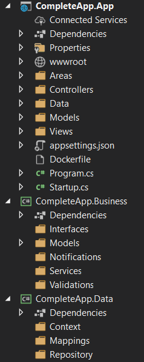
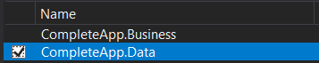
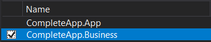
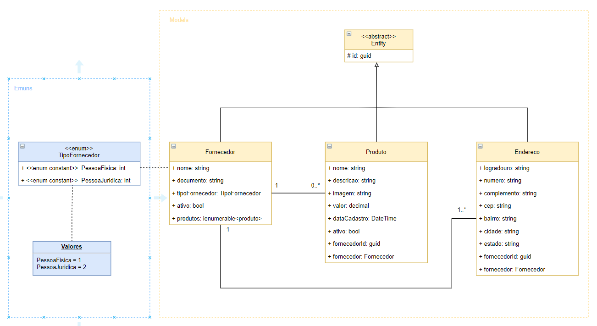
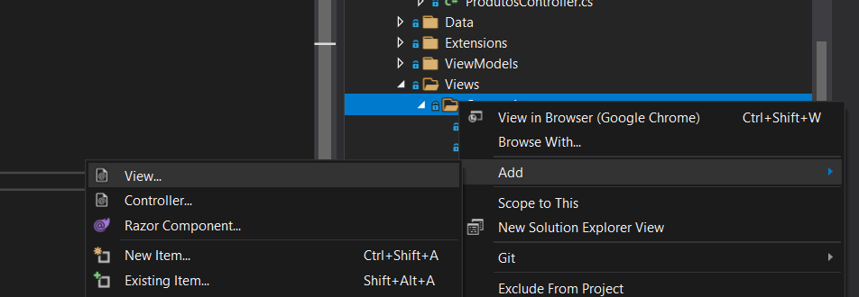
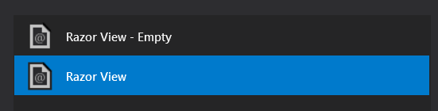
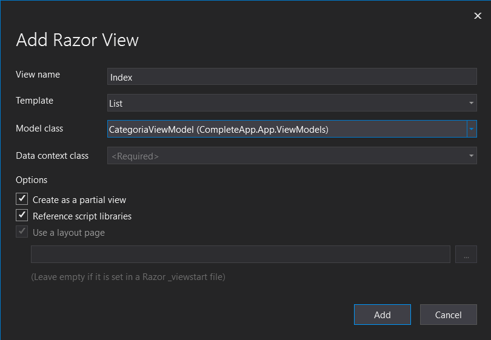

<h1 align="center">App Completo em ASP.NET Core MVC</h1>

<p align="center">Aplicação completa em ASP.NET Core MVC, contemplando um CRUD completo.</p>

---

### :dart: Objetivo

Tenho como objetivo implementar uma aplicação MVC completa em ASP.NET Core com C# contendo um CRUD completo dos dados, utilizando Entity Framework.  

### Clone

Clone este repositório em sua máquina local usando:  

```
git clone https://github.com/YuriSiman/complete-app-crud-aspnetcore-mvc.git
```

### :pencil2: Progresso

- [x] [Setup Inicial da Aplicação](https://github.com/YuriSiman/complete-app-crud-aspnetcore-mvc#setup-inicial-da-aplicação)  
- [x] [Instalar Pacotes](https://github.com/YuriSiman/complete-app-crud-aspnetcore-mvc#instalar-pacotes)  
- [x] [Adicionar Referências aos Projetos](https://github.com/YuriSiman/complete-app-crud-aspnetcore-mvc#adicionar-referências-aos-projetos)  
- [x] [Definir as entidades da aplicação](https://github.com/YuriSiman/complete-app-crud-aspnetcore-mvc#definir-as-entidades-da-aplicação)  
- [x] [Configurar seu DbContext](https://github.com/YuriSiman/complete-app-crud-aspnetcore-mvc#configurar-seu-dbcontext)  
- [x] [Configurar o mapeamento de suas entidades com FluentAPI](https://github.com/YuriSiman/complete-app-crud-aspnetcore-mvc#configurar-o-mapeamento-de-suas-entidades-com-fluentapi)  
- [x] [Gerar Migrations, Data Base e Scripts](https://github.com/YuriSiman/complete-app-crud-aspnetcore-mvc#gerar-migrations-data-base-e-scripts)  
- [x] [Repository Pattern](https://github.com/YuriSiman/complete-app-crud-aspnetcore-mvc#repository-pattern)  
- [x] [ViewModels](https://github.com/YuriSiman/complete-app-crud-aspnetcore-mvc#viewmodels)  
- [x] [AutoMapper](https://github.com/YuriSiman/complete-app-crud-aspnetcore-mvc#automapper)  
- [x] [Controllers](https://github.com/YuriSiman/complete-app-crud-aspnetcore-mvc#controllers)  
- [x] [Views](https://github.com/YuriSiman/complete-app-crud-aspnetcore-mvc#views)  
- [x] [Upload de Arquivos - Imagens](https://github.com/YuriSiman/complete-app-crud-aspnetcore-mvc#upload-de-arquivos---imagens)  
- [x] [Globalizando a Aplicação em pt-BR](https://github.com/YuriSiman/complete-app-crud-aspnetcore-mvc#globalizando-a-aplicação-em-pt-br)  
- [x] [Validações de Campos em Português](https://github.com/YuriSiman/complete-app-crud-aspnetcore-mvc#validações-de-campos-em-português)  
- [x] [Attributes](https://github.com/YuriSiman/complete-app-crud-aspnetcore-mvc#attributes)  

---

## :rocket: Vamos Começar 

## Setup Inicial da Aplicação 

A aplicação consiste em três camadas:  

**App** - configuração do projeto ASP.NET Core MVC Web Application. Nele está contido as configurações da aplicação, as views em HTML, nossas Controllers, o Identity para autenticação de usuários, configurações de ambiente e banco de dados, nossa classe Startup e nosso método Main.  
**Business** - configuração de uma Class Library .NET Core para as regras de negócio da aplicação, camada de domínio. Onde se encontra as Entidades de negócio, notificações, validações e serviços.  
**Data** - configuração de uma Class Library .NET Core para a camada de dados da aplicação, nele está contido o DbContext para o contexto de dados, as referências ao Entity Framework, Mappings, Migrations e Repositórios.  



* [Voltar ao Início](https://github.com/YuriSiman/complete-app-crud-aspnetcore-mvc#app-completo-em-aspnet-core-mvc)  

---

## Instalar Pacotes

Pacotes a serem instalados pelo Package Manager Console ou Manage NuGet Packages:  

Projeto - Camada App  
```
Install-Package Microsoft.EntityFrameworkCore.SqlServer
Install-Package Microsoft.EntityFrameworkCore.Design
Install-Package Automapper.Extensions.Microsoft.DependencyInjection
```
  
Projeto - Camada Data  
```
Install-Package Microsoft.EntityFrameworkCore
Install-Package Microsoft.EntityFrameworkCore.Relational
Install-Package Microsoft.EntityFrameworkCore.Tools
Install-Package Microsoft.EntityFrameworkCore.SqlServer
```

* [Voltar ao Início](https://github.com/YuriSiman/complete-app-crud-aspnetcore-mvc#app-completo-em-aspnet-core-mvc)  

---

## Adicionar Referências aos Projetos  

Projeto - Camada App



Projeto - Camada Data



* [Voltar ao Início](https://github.com/YuriSiman/complete-app-crud-aspnetcore-mvc#app-completo-em-aspnet-core-mvc)  

---

## Definir as entidades da aplicação

Modelo Entidade-Relacionamento conforme a utilização do Entity Framework.



* [Voltar ao Início](https://github.com/YuriSiman/complete-app-crud-aspnetcore-mvc#app-completo-em-aspnet-core-mvc)  

---

## Configurar seu DbContext

#### Contexto de Dados

O seu contexto de dados deve herdar da classe DbContext, implementando as propriedades DbSet referente a cada entidade da sua aplicação.  
Deve-se sobrescrever o método OnModelCreating, para que nele possamos pegar nosso contexto de dados, buscar todas as entidades mapeadas pelo DbSet e buscar classes que implementam a interface IEntityTypeConfiguration, ou seja, ele pegará cada um dos Mappings a serem implementados e fará o mapeamento de uma vez só.  

No método OnModelCreating também podemos **desabilitar** o **Cascade Delete**, ou seja, desabilitar a exclusão de objetos ligados diretamente a uma outra entidade. Ex: excluir um fornecedor e todos os seus produtos juntos.

#### Configurando seu DbContext na sua classe Startup

É necessário configurar o serviço do seu contexto de dados dentro da sua classe Startup, no método ConfigureServices. Segue exemplo de implementação abaixo:

```
services.AddDbContext<SeuDbContext>(options =>
       options.UseSqlServer(Configuration.GetConnectionString("DefaultConnection")));
```

Também é preciso configurar o serviço para injeção de dependência do seu DbContext na classe Startup, no método ConfigureServices, conforme implementação abaixo:

```
services.AddScoped<SeuDbContext>();
```

#### Configurando o arquivo appsettings.json

Após a implementação do DbContext na Startup, é necessário passar as informações do banco de dados na **ConnectionStrings** dentro do arquivo appsettings.json. Essa **ConnectionString** possui a **DefaultConnection** que é chamada dentro do serviço que adiciona o seu contexto de dados na sua classe Startup.  

```
"ConnectionStrings": {
    "DefaultConnection": "Server=(localdb)\\mssqllocaldb;Database=SeuDb;Trusted_Connection=True;MultipleActiveResultSets=true"
  }
```

* [Voltar ao Início](https://github.com/YuriSiman/complete-app-crud-aspnetcore-mvc#app-completo-em-aspnet-core-mvc)  

---

## Configurar o mapeamento de suas entidades com FluentAPI

Mapeando as entidades para o banco de dados com o FluentApi, é o ideal para não poluir suas entidades com os DataAnnotations. Para o mapeamento é feita a implementação da interface IEntityTypeConfiguration<Entity>, com a qual é criada uma classe para mapeamento específico de cada entidade, definindo campos como Primary Key, definindo o tipo da propriadade a ser inserida na base, o nome de cada tabela na base de dados e o relacionamento entre as entidades. 

* [Voltar ao Início](https://github.com/YuriSiman/complete-app-crud-aspnetcore-mvc#app-completo-em-aspnet-core-mvc)  

---

## Gerar Migrations, Data Base e Scripts

Package Manager Console  

Gerando Migrations  

```
Add-Migration NomeMigration -Context SeuDbContext
```

Gerando Base de Dados  

```
Update-Database -Context SeuDbContext
```

Gerando Scripts Idempotentes  

```
Script-Migration -Idempotent
```

* [Voltar ao Início](https://github.com/YuriSiman/complete-app-crud-aspnetcore-mvc#app-completo-em-aspnet-core-mvc)  

---

## Repository Pattern

O repository pattern é implementado nesta aplicação para que as camadas de Business e App possuam um meio de acesso para conversar com o banco de dados, que não seja diretamente pelo DbContext, pois, não é adequado injetar o DbContext diretamente nas Controllers, devemos sempre buscar o desacoplamento do meio de acesso a dados.  

#### IRepository - Camada Business

Devemos criar a interface genérica IRepository<TEntity> dentro da camada de Negócios **(Business)** para que a camada de Negócios não tenha nenhuma referência com a camada de Dados **(Data)**, ela irá "conversar" com a camada de dados por meio da interface IRepository<TEntity>, para que ela possa fornecer os métodos necessários para os repositórios que ficarão na camada de dados.  
Esta interface deverá implementar a interface **IDisposable** para obrigar que o repositório faça a liberação de memória. Outro detalhe é o fato de podermos configurar para que a interface IRepository<TEntity> apenas seja utilizada por entidades que sejam filhas (que herdem) da classe **Entity**.

Seguem os métodos assíncronos a serem implementados na interface genérica:

```
Task Adicionar(TEntity entity);
Task<TEntity> ObterPorId(Guid id);
Task<List<TEntity>> ObterTodos();
Task Atualizar(TEntity entity);
Task Remover(Guid id);
Task<IEnumerable<TEntity>> Buscar(Expression<Func<TEntity, bool>> predicate);
Task<int> SaveChanges();
```

Agora deve-se criar as interfaces referentes a cada entidade que será persistida no banco de dados da sua aplicação, e cada uma delas deverá implementar a interface genérica **IRepository**. Isso nos dará uma maior autonomia para manipular dados de forma independente para cada entidade.  

#### Repository - Camada Data

Criando classe abstrata e genérica Repository<TEntity> implementando a interface genérica IRepository<TEntity>, onde a entidade TEntity precisar ser filha (herdar) da entidade abstrata **Entity**.  
Nesta classe serão implementados os métodos da interface para a persistência dos dados da aplicação. Os métodos são assíncronos possuindo o termo **async** e podemos também implementar o **virtual** para que os mesmos possam ser sobrescritos.  

Agora deve-se criar as classes referentes a cada entidade que será persistida no banco de dados da sua aplicação, e cada uma delas deverá herdar de Repository<EntidadeAtual> (a entidade correspondente da classe) e também implementar a interface correspondente à mesma entidade. Os métodos são assíncronos possuindo o termo **async**.

#### Configurando os repositórios na classe Startup por meio de injeção de dependência

É preciso configurar o serviço para injeção de dependência dos seus repositórios na classe Startup, no método ConfigureServices, conforme o exemplo abaixo:

```
services.AddScoped<IProdutoRepository, ProdutoRepository>();
services.AddScoped<IFornecedorRepository, FornecedorRepository>();
services.AddScoped<IEnderecoRepository, EnderecoRepository>();
services.AddScoped<ICategoriaRepository, CategoriaRepository>();
```

* [Voltar ao Início](https://github.com/YuriSiman/complete-app-crud-aspnetcore-mvc#app-completo-em-aspnet-core-mvc)  

---

## ViewModels

Troca de informação entre os modelos de negócio (Business) com os modelos que serão exibidos na camada de apresentação (App), replicando os modelos de negócio para modelos intermediários chamados de **ViewModels** ou **DTO** (Data Transfer Object).  

Não queremos "deformar" nossas entidades de negócio colocando campos que não serão mapeados no banco, mapeando propriedades que não são ligados à regra de negócio... queremos simplesmente criar modelos que sejam passíveis de serem exibidos na tela. Então, devemos criar uma **ViewModel** para cada **Model** existente em nossa camada de negócio. As **ViewModels** criadas precisam ter as **propriedades** necessárias e também o **Id** referente a cada entidade (uma vez que não iremos herdar de nenhuma Entity).  

#### Data Annotations

Devemos implementar os Data Annotations para mapear cada propriedade referente a cada **ViewModel**.  

* [Voltar ao Início](https://github.com/YuriSiman/complete-app-crud-aspnetcore-mvc#app-completo-em-aspnet-core-mvc)  

---

## AutoMapper

Package Manager Console  

Projeto - Camada App  

```
Install-Package Automapper.Extensions.Microsoft.DependencyInjection
```

Fazendo a transformação de **ViewModel** para **Model** e **Model** para **ViewModel** com **Automapper**.

#### Configurando o Automapper na classe Startup

É preciso configurar o serviço do AutoMapper na classe Startup, no método ConfigureServices, conforme o exemplo abaixo:  

```
services.AddAutoMapper(typeof(Startup));
```

Devemos criar uma classe AutoMapperConfig para configuração do Automapper, a classe deverá herdar de **Profile**. Nesta classe será definido o mapeamento das ViewModels e Models, segue exemplo abaixo:  

```
public AutoMapperConfig()
        {
            CreateMap<Fornecedor, FornecedorViewModel>().ReverseMap();
            CreateMap<Endereco, EnderecoViewModel>().ReverseMap();
            CreateMap<Produto, ProdutoViewModel>().ReverseMap();
            CreateMap<Categoria, CategoriaViewModel>().ReverseMap();
        }
```

* [Voltar ao Início](https://github.com/YuriSiman/complete-app-crud-aspnetcore-mvc#app-completo-em-aspnet-core-mvc)  

---

## Controllers

Ao criar cada Controller nós devemos chamar o repositório referente a cada uma delas pela interface para que tenhamos o meio de acesso a dados, também chamaremos nosso AutoMapper para fazer o mapeamento de Model e ViewModel.

* [Voltar ao Início](https://github.com/YuriSiman/complete-app-crud-aspnetcore-mvc#app-completo-em-aspnet-core-mvc)  

---

## Views

Para cada Controller criada, também criaremos as View. Podemos criar o modelo inicial das Views por meio do Visual Studio 2019, gerando automaticamente por Scaffolded as telas baseadas em nossas ViewModels, são elas:

```
Create
Delete
Details
Edit
Index
```

Segue passo a passo para criar cada uma das Views:





* [Voltar ao Início](https://github.com/YuriSiman/complete-app-crud-aspnetcore-mvc#app-completo-em-aspnet-core-mvc)  

---

## Upload de Arquivos - Imagens

Para configurar o Upload de arquivos, será criado uma classe chamada UploadFiles, dentro de uma pasta Extensions. Essa classe terá um método para o Upload de Imagens, chamando o caminho com o qual ficarão as imagens ```wwwroot/img```.

Segue método a ser implementado para o Upload de imagens.

```
public async Task<bool> UploadImage(IFormFile arquivo, string imgPrefixo)
        {
            if (arquivo.Length <= 0) return false;

            var path = Path.Combine(Directory.GetCurrentDirectory(), "wwwroot/img", imgPrefixo + arquivo.FileName);

            if (File.Exists(path)) return false;

            using (var stream = new FileStream(path, FileMode.Create))
            {
                await arquivo.CopyToAsync(stream);
            }

            return true;
        }
```

Esta classe será chamada na Controller que precisará realizar o Upload de Imagem, então, injetaremos ela por meio de injeção de dependência.

Lembrando que devemos adicionar o serviço em nossa Startup para fazer a injeção de dependência:

```
services.AddScoped<UploadFiles>();
```

Na Controller deverão ser criados os métodos necessários para a manipulação de Upload e Update das imagens.

* [Voltar ao Início](https://github.com/YuriSiman/complete-app-crud-aspnetcore-mvc#app-completo-em-aspnet-core-mvc)  

---

## Globalizando a Aplicação em pt-BR

Para que nossa aplicação se comporte em pt-BR devemos implementar configurações de Globalização. Seguem abaixo as configurações implementadas:


* _Layout.cshtml

```
@System.Globalization.CultureInfo.CurrentUICulture
```

* Startup.cs - Método Configure

```
var defaultCulture = new CultureInfo("pt-BR");
            var localizationOptions = new RequestLocalizationOptions
            {
                DefaultRequestCulture = new RequestCulture(defaultCulture),
                SupportedCultures = new List<CultureInfo> { defaultCulture },
                SupportedUICultures = new List<CultureInfo> { defaultCulture }
            };
            app.UseRequestLocalization(localizationOptions);
```

* _ValidationScriptsPartial.cshtml - Script para globalizar moedas e datas

```
<script>
    $.validator.methods.range = function (value, element, param) {
        var globalizedValue = value.replace(",", ".");
        return this.optional(element) || (globalizedValue >= param[0] && globalizedValue <= param[1]);
    };
    $.validator.methods.number = function (value, element) {
        return this.optional(element) || /-?(?:\d+|\d{1,3}(?:[\s\.,]\d{3})+)(?:[\.,]\d+)?$/.test(value);
    };
    $.validator.methods.date = function (value, element) {
        var date = value.split("/");
        return this.optional(element) || !/Invalid|NaN/.test(new Date(date[2], date[1], date[0]).toString());
    };
</script>
```

* [Voltar ao Início](https://github.com/YuriSiman/complete-app-crud-aspnetcore-mvc#app-completo-em-aspnet-core-mvc)  

---

## Validações de Campos em Português

Traduzindo todas as possíveis mensagens de erro das validações do ```ModelBindingMessageProvider``` para Português, implementação realizada dentro da **Startup**.

```
services.AddControllersWithViews(o =>
            {
                o.ModelBindingMessageProvider.SetAttemptedValueIsInvalidAccessor((x, y) => "O valor preenchido é inválido para este campo.");
                o.ModelBindingMessageProvider.SetMissingBindRequiredValueAccessor(x => "Este campo precisa ser preenchido.");
                o.ModelBindingMessageProvider.SetMissingKeyOrValueAccessor(() => "Este campo precisa ser preenchido.");
                o.ModelBindingMessageProvider.SetMissingRequestBodyRequiredValueAccessor(() => "É necessário que o body na requisição não esteja vazio.");
                o.ModelBindingMessageProvider.SetNonPropertyAttemptedValueIsInvalidAccessor(x => "O valor preenchido é inválido para este campo.");
                o.ModelBindingMessageProvider.SetNonPropertyUnknownValueIsInvalidAccessor(() => "O valor preenchido é inválido para este campo.");
                o.ModelBindingMessageProvider.SetNonPropertyValueMustBeANumberAccessor(() => "O campo deve ser numérico");
                o.ModelBindingMessageProvider.SetUnknownValueIsInvalidAccessor(x => "O valor preenchido é inválido para este campo.");
                o.ModelBindingMessageProvider.SetValueIsInvalidAccessor(x => "O valor preenchido é inválido para este campo.");
                o.ModelBindingMessageProvider.SetValueMustBeANumberAccessor(x => "O campo deve ser numérico.");
                o.ModelBindingMessageProvider.SetValueMustNotBeNullAccessor(x => "Este campo precisa ser preenchido.");

                o.Filters.Add(new AutoValidateAntiforgeryTokenAttribute());
            });
```

* [Voltar ao Início](https://github.com/YuriSiman/complete-app-crud-aspnetcore-mvc#app-completo-em-aspnet-core-mvc)  

---

## Attributes

Criando na pasta Extensions os Attributes para a customização de DataAnnotations. Implementar classes para tratamento tanto no client quanto no server.  

* Moedas - MoedaAttribute

```
// MoedaAttribute.cs

public class MoedaAttribute : ValidationAttribute
    {
        protected override ValidationResult IsValid(object value, ValidationContext validationContext)
        {
            try
            {
                var moeda = Convert.ToDecimal(value, new CultureInfo("pt-BR"));
            }
            catch (Exception)
            {
                return new ValidationResult("Moeda em formato inválido");
            }

            return ValidationResult.Success;
        }
    }
    

// MoedaAttributeAdapter.cs

public class MoedaAttributeAdapter : AttributeAdapterBase<MoedaAttribute>
    {
        public MoedaAttributeAdapter(MoedaAttribute attribute, IStringLocalizer stringLocalizer) : base(attribute, stringLocalizer) { }

        public override void AddValidation(ClientModelValidationContext context)
        {
            if (context == null) throw new ArgumentNullException(nameof(context));

            MergeAttribute(context.Attributes, "data-val", "true");
            MergeAttribute(context.Attributes, "data-val-moeda", GetErrorMessage(context));
            MergeAttribute(context.Attributes, "data-val-number", GetErrorMessage(context));
        }
        public override string GetErrorMessage(ModelValidationContextBase validationContext)
        {
            return "Moeda em formato inválido";
        }
    }
    

// MoedaValidationAttributeAdapterProvider.cs    
    
public class MoedaValidationAttributeAdapterProvider : IValidationAttributeAdapterProvider
  {
      private readonly IValidationAttributeAdapterProvider _baseProvider = new ValidationAttributeAdapterProvider();

      public IAttributeAdapter GetAttributeAdapter(ValidationAttribute attribute, IStringLocalizer stringLocalizer)
      {
          if (attribute is MoedaAttribute moedaAttribute) return new MoedaAttributeAdapter(moedaAttribute, stringLocalizer);

          return _baseProvider.GetAttributeAdapter(attribute, stringLocalizer);
      }
  }
```

Implementando a tag **[Moeda]** dentro da ViewModel, no campo Valor:

```
[Moeda]
[Required(ErrorMessage = "O campo {0} é obrigatório")]
public decimal Valor { get; set; }
```

Injetar o **MoeadaAdapter** via injeção de dependência na Startup:

```
services.AddSingleton<IValidationAttributeAdapterProvider, MoedaValidationAttributeAdapterProvider>();
```

Por fim, podemos formatar o campo **Valor** em todoas as Views para que o valor seja exibido formatado conforme a sua moeda:

* Details.cshtml

```
<dd class="col-sm-10">
  @Model.Valor.ToString("C")
</dd>
```

* Index.cshtml

```
<td>
  @item.Valor.ToString("C")
</td>
```

* [Voltar ao Início](https://github.com/YuriSiman/complete-app-crud-aspnetcore-mvc#app-completo-em-aspnet-core-mvc)  

---

## :vertical_traffic_light: Status do Projeto

:construction: Projeto sendo implementado :construction:

---

## :thinking: Contribuindo

> Para começar...

### Passo 1

* :fork_and_knife: Fork este repositório!

### Passo 2

* :dancers: Clone este repositório para sua máquina local usando `git clone https://github.com/YuriSiman/complete-app-crud-aspnetcore-mvc.git`

### Passo 3

* :trident: Crie sua feature branch usando `git checkout -b minha-feature`

### Passo 4

* :white_check_mark: Commit suas mudanças usando `git commit -m "feat: Minha nova feature"`

### Passo 5

* :pushpin: Dê um push usando `git push -u origin minha-feature`

### Passo 6

* :arrows_clockwise: Crie um novo pull request

Depois que seu pull request for mesclado, você pode excluir sua feature branch  

> Caso tenha dúvidas, confira este guia de como [contribuir no GitHub](https://github.com/firstcontributions/first-contributions)  

---

## :speech_balloon: Suporte

> Entre em contato comigo...  

* Me chame pelo [Linkedin](https://www.linkedin.com/in/yurisiman/)  
* Me mande um e-mail [contato@yurisiman.com.br](mailto:contato@yurisiman.com.br)  

[](https://github.com/YuriSiman)  
[](https://yurisiman.com.br)  

---

## :pencil: Licença

[](https://github.com/YuriSiman/complete-app-crud-aspnetcore-mvc/blob/master/LICENSE)   

---

Code your life...
